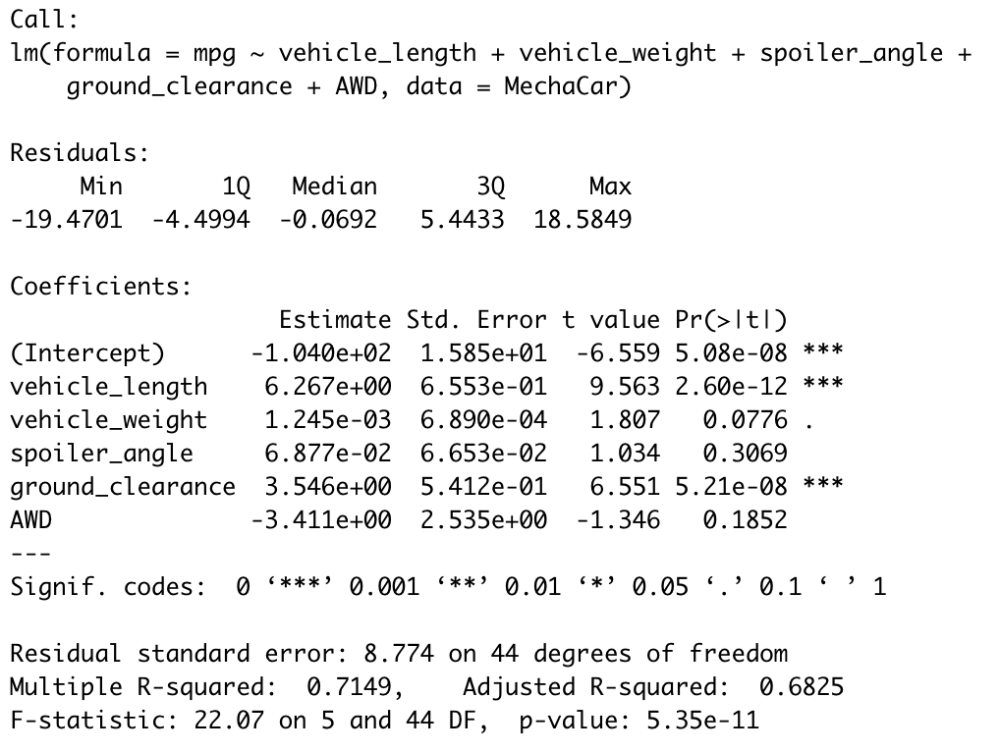
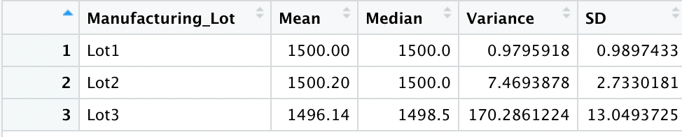
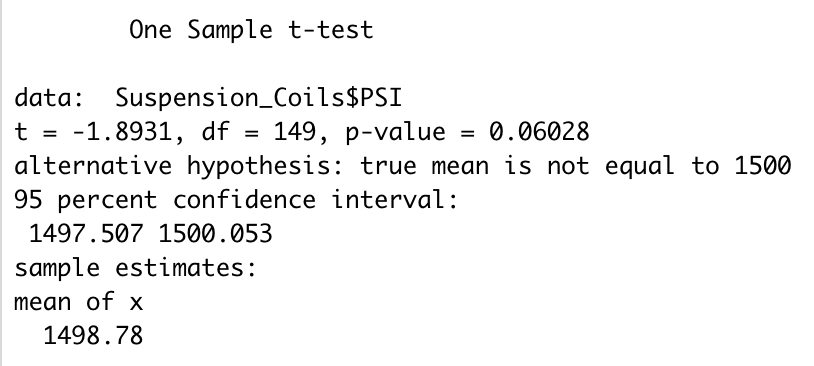
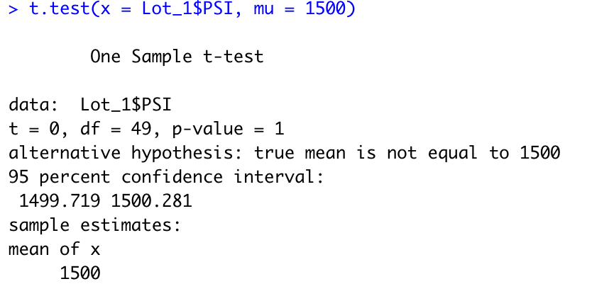
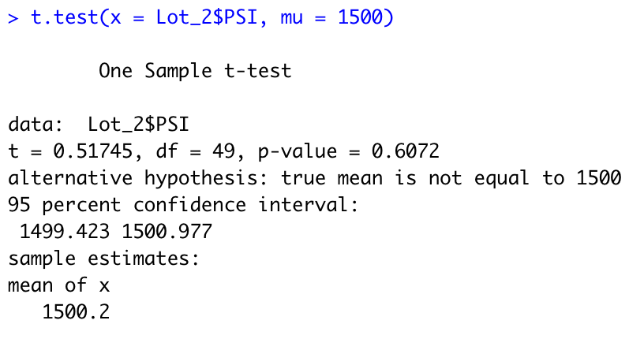
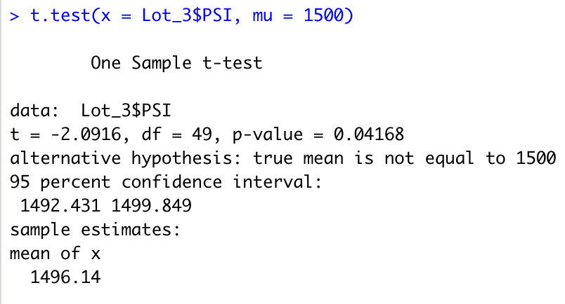

# Overview: MechaCar Statistical Analysis

In this analysis I've reviewed production data for the hypothetical car manufacturing company AutosRUs, whose manufacturing team progress is currently being blocked by production troubles with a new car prototype, the MechaCar. 

I used R, RStudio and AutosRUs' [suspension coil manufacturing dataset](https://github.com/npvandyke/MechaCar_Statistical_Analysis/blob/main/Deliverable_Three/Suspension_Coil.csv) and [MechaCar MPG dataset](https://github.com/npvandyke/MechaCar_Statistical_Analysis/blob/main/Deliverable_One/MechaCar_mpg.csv) to perform a retrospective analysis of historical data, analytical verification and validation of current automotive specifications and a study design of A/B product testing. 

# Results: 

## Linear Regression to Predict MPG
- Given a significance cutoff of 0.05, 'vehicle length', 'ground clearance' and the intercept were the only variables or coefficients to provide a non-random amount of variance to the mpg values in the dataset as indicated by their p-values. 
- Given the intercept and two signifcant independent variables in the model, the slope-intercept equation for this dataset can be written as:
`mpg = 6.27 * vehicle length + 3.55 * ground clearance + -0.01` , where 'mpg' is the y-value, 'vehicle length' and 'ground clearance' are the two x-values, '6.27' and '3.55' are the two slope values and '-.01' is the y-intercept value. 
- Given the r-squared value of 0.7149, we can say that there is approximately a 70% chance that any extra given data points not already included in the dataset can be accurately predicted by this model. 
  - However, it should be noted that the significance of the p-value of the intercept indicates that there are other independent variables significantly contributing to variance to the mpg values which have not been accounted for in this dataset. 
  - Further, the number of variables with insignifcant p-values is evidence of overfitting, meaning that while the model performs fairly well with the current dataset, it may fail to generalize and predict future data correctly.

The results of the multiple linear regression test performed on the [MechaCar MPG dataset](https://github.com/npvandyke/MechaCar_Statistical_Analysis/blob/main/Deliverable_One/MechaCar_mpg.csv) can be viewed below:  

| Multiple Linear Regression Results |
:-------------------------------------:

## Summary Statistics on Suspension Coils
- The design specifications for the MechaCar suspension coils dictate that the variance of the suspension coils must not exceed 100 pounds per square inch. Based on the summary of manufacturing data derived from the "Suspension_Coil.csv" dataset, it's apparent that this design specification is met for all manufacturing lots in total, as well as for Lot 1 and Lot 2, but Lot 3's variance exceeds this amount. 

The summary data for the three combined lots as well as for each individual lot can be viewed below: 

| Total Summary            |  Lot Summary |
:-------------------------:|:-------------------------:
 | 

## T-Tests on Suspension Coils
Having performed four one-sample, two-tailed t-tests on the [suspension coil manufacturing dataset](https://github.com/npvandyke/MechaCar_Statistical_Analysis/blob/main/Deliverable_Three/Suspension_Coil.csv) for the data across all manufacturing lots as well as the data for each specific lot, given a significance cutoff of 0.05, we are unable to reject the null hypthoses that there is no signicant difference between the sample mean and given population mean of 1500 PSI for the Lot Summary sample, Lot 1 sample and Lot 2 sample (based on their p-values). For the Lot 3 sample, we are able to reject the null hypothesis, and accept the alternative hypothesis that there *is* a significant difference between the sample mean and given population mean of 1500 PSI. 

The results of the four one-sample, two-tailed t-tests can be viewed below: 

| Lot Summary vs. Population | 
:-------------------------:

| Lot 1 vs. Population | Lot 2 vs. Population | Lot 3 vs. Population |
:-------------------------:|:-----------------:|:-------------------------:
 |  | 

# Study Design: MechaCar vs Competition A/B Product Testing 

In order to quantify how AutosRUs' MechaCar performs against competing car manufacturer models, I've designed a statistical study to compare multiple metrics that may be of interest to a consumer: including cost, city fuel efficiency, highway fuel efficiency, horse power and safety ratings. These metrics will be compared across vehicle class for the MechaCar and four other leading car manufacturers. 

For the study, I will be conducting multiple two-way ANOVA tests, one for each of the dependent metrics listed above (cost, city fuel efficiency, highway fuel efficiency, horse power and safety ratings). Considering that each test will involve two categorical independent variables (vehicle class and car manufacturer) with a dependent variable that is continuous and numeric (whose means will be compared across five sample groups), a two-way ANOVA test will be a perfect fit for this study design. 

In the hypothesis testing for this study, a null hypothesis will indicate that there is no significant variation in the means of the dependent variable being tested. Acceptance of the alternative hypothesis will indicate that at least one of the means is different from all other groups. 

In order to conduct this study, a sufficiently large dataset will be required, with at least 50 data points for each dependent variable in each vehicle class for all five groups (MechaCar and the four other leading car manufactureres). Given said dataset, the R script for the five one-way ANOVA tests to run using the dplyr library in R would look like this: 

`read.csv("five_car_manufacturers.csv")`

`summary(aov(city_mpg ~ vehicle_class + car_manufacturer, data = five_car_manufacturers))`  
`summary(aov(hwy_mpg ~ vehicle_class + car_manufacturer, data = five_car_manufacturers))`  
`summary(aov(horsepower ~ vehicle_class + car_manufacturer, data = five_car_manufacturers))`  
`summary(aov(cost ~ vehicle_class + car_manufacturer, data = five_car_manufacturers))`  
`summary(aov(saftey_rtg ~ vehicle_class + car_manufacturer, data = five_car_manufacturers))` 
